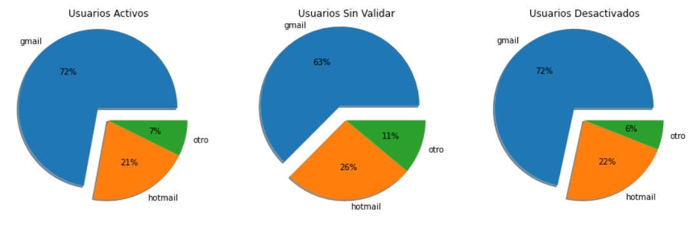
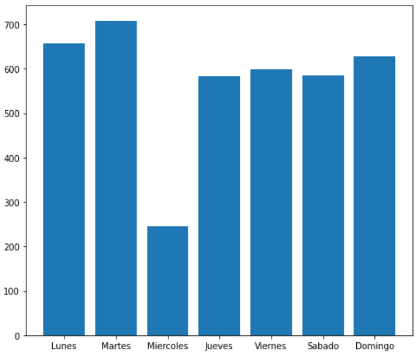
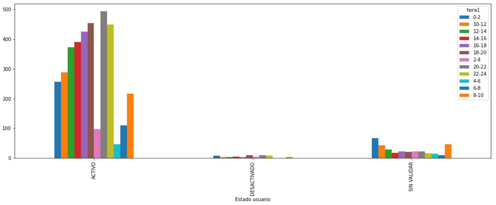

# Actividad 5
# Sebastián Hernández Mantilla


```python
import pandas as pd
import numpy as np
import matplotlib.pyplot as plt
from datetime import datetime
import warnings
import seaborn as sns
warnings.filterwarnings('ignore')
```


```python
# se lee el archivo
df = pd.read_csv(r'C:\Users\Sebastian Hernandez\Especializacion\Semestre2\Decisiones_incertidumbre\practicas\Actividad5\entrega\datos_horas_conexion.csv',';')
# se eliminan las variables con Nan
df.dropna(inplace=True)

df.head()
```


<div>
<style scoped>
    .dataframe tbody tr th:only-of-type {
        vertical-align: middle;
    }

    .dataframe tbody tr th {
        vertical-align: top;
    }

    .dataframe thead th {
        text-align: right;
    }
</style>
<table border="1" class="dataframe">
  <thead>
    <tr style="text-align: right;">
      <th></th>
      <th>id_usuario</th>
      <th>Calificadora</th>
      <th>Correo</th>
      <th>Fecha Consulta</th>
      <th>Estado usuario</th>
    </tr>
  </thead>
  <tbody>
    <tr>
      <th>0</th>
      <td>c2290d89dfc4</td>
      <td>Buró de Crédito</td>
      <td>gmail.com</td>
      <td>19/01/21 9:20</td>
      <td>ACTIVO</td>
    </tr>
    <tr>
      <th>1</th>
      <td>8d24ef1d52d8</td>
      <td>Buró de Crédito</td>
      <td>gmail.com</td>
      <td>19/01/21 8:28</td>
      <td>ACTIVO</td>
    </tr>
    <tr>
      <th>2</th>
      <td>a5120d2c47fa</td>
      <td>Buró de Crédito</td>
      <td>gmail.com</td>
      <td>17/01/21 13:36</td>
      <td>ACTIVO</td>
    </tr>
    <tr>
      <th>3</th>
      <td>5a5d70893606</td>
      <td>Buró de Crédito</td>
      <td>edubc.mx</td>
      <td>20/01/21 9:27</td>
      <td>ACTIVO</td>
    </tr>
    <tr>
      <th>4</th>
      <td>4a2082948031</td>
      <td>Buró de Crédito</td>
      <td>gmail.com</td>
      <td>21/01/21 14:26</td>
      <td>ACTIVO</td>
    </tr>
  </tbody>
</table>
</div>


## Análisis por columnas

### Estado usuario


```python
print('Se describe la columna: '+ '\n' + str(df['Estado usuario'].describe()[0:-1]) + '\n')
print('Se imprime la lista de valores únicos de la columna:' + '\n' + str(df['Estado usuario'].unique()))
```

    Se describe la columna: 
    count       4003
    unique         3
    top       ACTIVO
    Name: Estado usuario, dtype: object
    
    Se imprime la lista de valores únicos de la columna:
    ['ACTIVO' 'SIN VALIDAR' 'DESACTIVADO']
    

#### La columna de estado tiene 3 valores únicos,('ACTIVO','DESACTIVADO','SIN VALIDAR'), se infiere que los usuarios con estado activo estan usando los servicios de la empresa 

### Calificadora


```python
print('Se describe la columna: '+ '\n' + str(df['Calificadora'].describe()[0:-1]) + '\n')
print('Se imprime la lista de valores únicos de la columna:' + '\n' + str(df['Calificadora'].unique()))
```

    Se describe la columna: 
    count                4003
    unique                  1
    top       Buró de Crédito
    Name: Calificadora, dtype: object
    
    Se imprime la lista de valores únicos de la columna:
    ['Buró de Crédito']
    


```python
df.drop('Calificadora',axis=1,inplace = True)
```

#### todos los registros tienen el mismo valor en esta columna, por este motivo no se toma en cuenta en el resto del análisis

### Correo

#### En la columna de correos se encontraron muchos mal escritos, para cambiarlos se utiliza la librería fuzzywuzzy para encontrar strings similares a los corres más repetidos


```python
df['Correo'].unique()
```


    array(['gmail.com', 'edubc.mx', 'oitlook.com', 'hotmail.com',
           'hotmail.es', 'outlook.com', 'gmail.comma', 'yahoo.com.mx',
           'gmail.Com', 'me.com', 'live.com.mx', 'gmail.com.mx',
           'ittepic.edu.mx', 'sohe95.com', 'multiva.com.mx', 'hotmai.com',
           'avantservices.com.mx', 'icloud.com', 'yahoo.com', 'live.com',
           'liverpool.com.mx', 'gmeil.com', 'GMAIL.COM', 'telefonica.com',
           'msn.com', 'gmail.comlaura', 'outlook.con', 'outlook.es',
           'hotmil.com', 'mail.ru', 'hormail.com', 'hotmail.comRICARDO',
           'g2telecom.com.mx', 'hotmail.con', 'hotmail.com.mx', 'gmail.con',
           'mail.com', 'mx.ey.com', 'saetowers.com.mx', '5675gmail.com',
           'tec.mx', 'gmail.comsagrario', 'hotmaol.com', 'gotmail.com',
           'yomax.com.mx', 'suramexico.com', 'g.conai.com', 'hitmail.com',
           'g.mail.com.mx', 'exatec.tec.mx', 'jotmail.com', 'gitsmfg.com',
           'sermatel.mx', 'prodigy.net.mx', 'outlook.coma', 'gmal.com',
           'gmai.com', '13gmail.com', 'g.mai.com', 'bbva.com', 'gamil.com',
           'madisa.com', 'GMAIL.com', '2473gmail.com',
           'hutchinson-seal-mexico.com', 'gmail.coml', 'olxautos.com',
           'gnail.com', 'gmil.com', 'osiux.ws', 'yansa.com.mx',
           'aefcm.nuevaescuela.mx', 'hatmail.com', 'MSN.COM', 'gimail.com',
           'HOTMAIL.COM', 'ymail.com', 'prodyaut.com', 'cfe.mx',
           'Hotmail.com', 'gmail.co.com', 'guanajuato.gob.mzx', 'live.co.uk',
           'riconsa.com', '232gmail.com', 'gmail.comcom', '1982gmail.com',
           'hotmail.Com', 'gmaim.com', 'hot.mail.com', 'occidente.edu.mx',
           'outlok.es', 'test.com'], dtype=object)


```python
from fuzzywuzzy import fuzz
#df1=df
df['Correo'] = df['Correo'].apply(lambda x: 'gmail.com' if (fuzz.ratio('gmail.com',x.lower()) > 80)   else x)
df['Correo'] = df['Correo'].apply(lambda x: 'hotmail.com' if (fuzz.ratio('hotmail.com',x.lower()) > 80)  else x )
df['Correo'] = df['Correo'].apply(lambda x: 'outlook.com' if (fuzz.ratio('outlook.com',x.lower()) > 70)   else x)
```


```python
df['Correo'].unique()
```


    array(['gmail.com', 'edubc.mx', 'outlook.com', 'hotmail.com',
           'hotmail.es', 'yahoo.com.mx', 'me.com', 'live.com.mx',
           'ittepic.edu.mx', 'sohe95.com', 'multiva.com.mx',
           'avantservices.com.mx', 'icloud.com', 'yahoo.com', 'live.com',
           'liverpool.com.mx', 'telefonica.com', 'msn.com', 'gmail.comlaura',
           'mail.ru', 'hotmail.comRICARDO', 'g2telecom.com.mx', 'mx.ey.com',
           'saetowers.com.mx', 'tec.mx', 'gmail.comsagrario', 'yomax.com.mx',
           'suramexico.com', 'g.conai.com', 'exatec.tec.mx', 'gitsmfg.com',
           'sermatel.mx', 'prodigy.net.mx', 'bbva.com', 'madisa.com',
           'hutchinson-seal-mexico.com', 'olxautos.com', 'osiux.ws',
           'yansa.com.mx', 'aefcm.nuevaescuela.mx', 'MSN.COM', 'prodyaut.com',
           'cfe.mx', 'guanajuato.gob.mzx', 'live.co.uk', 'riconsa.com',
           'occidente.edu.mx', 'outlok.es', 'test.com'], dtype=object)


#### Se cambian manualmente los restantes


```python
df['Correo'] = df['Correo'].apply(lambda x: 'gmail.com' if ('gmail.comsagrario' == x or 'gmail.comlaura' == x)   else x)
df['Correo'] = df['Correo'].apply(lambda x: 'outlook.com' if ('outlok.es' == x )   else x)
df['Correo'] = df['Correo'].apply(lambda x: 'hotmail.com' if ('hotmail.comRICARD' == x or 'hotmail.es' == x)   else x)
```


```python
#fig, axs = plt.subplots(1,3)
fig, (ax1,ax2,ax3) = plt.subplots(1,3,figsize=(15,15))

count11 = df[df['Estado usuario'] == 'ACTIVO'][df['Correo'] == 'gmail.com'].count()[0]
count12 = df[df['Estado usuario'] == 'ACTIVO'][df['Correo'] == 'hotmail.com'].count()[0]
count13 = df[df['Estado usuario'] == 'ACTIVO'][df['Correo'] != 'gmail.com'][df['Correo'] != 'hotmail.com'].count()[0]

y1 = np.array([count11,count12,count13])
labels = ['gmail','hotmail','otro']
myexplode = [0.2, 0, 0]
ax1.pie(y1, labels = labels, explode = myexplode, shadow = True, autopct='%1.0f%%')
ax1.set_title(label='Usuarios Activos')

count21 = df[df['Estado usuario'] == 'SIN VALIDAR'][df['Correo'] == 'gmail.com'].count()[0]
count22 = df[df['Estado usuario'] == 'SIN VALIDAR'][df['Correo'] == 'hotmail.com'].count()[0]
count23 = df[df['Estado usuario'] == 'SIN VALIDAR'][df['Correo'] != 'gmail.com'][df['Correo'] != 'hotmail.com'].count()[0]

y2 = np.array([count21,count22,count23])
labels = ['gmail','hotmail','otro']
myexplode = [0.2, 0, 0]
ax2.pie(y2, labels = labels, explode = myexplode, shadow = True, autopct='%1.0f%%')
ax2.set_title('Usuarios Sin Validar')

count31 = df[df['Estado usuario'] == 'DESACTIVADO'][df['Correo'] == 'gmail.com'].count()[0]
count32 = df[df['Estado usuario'] == 'DESACTIVADO'][df['Correo'] == 'hotmail.com'].count()[0]
count33 = df[df['Estado usuario'] == 'DESACTIVADO'][df['Correo'] != 'gmail.com'][df['Correo'] != 'hotmail.com'].count()[0]

y3 = np.array([count31,count32,count33])
labels = ['gmail','hotmail','otro']
myexplode = [0.2, 0, 0]
ax3.pie(y3, labels = labels, explode = myexplode, shadow = True, autopct='%1.0f%%')
ax3.set_title('Usuarios Desactivados')
plt.show() 

```



#### Se encontró que la distribución de correos es muy parecida para los valores de la columna de Estado

### id_usuario


```python
print('Se describe la columna: '+ '\n' + str(df['id_usuario'].describe()[0:-1]) + '\n')
```

    Se describe la columna: 
    count             4003
    unique            3679
    top       fdcc844fb3b0
    Name: id_usuario, dtype: object
    
    

#### Se encuentra que el número de valores únicos es menor al número total de registros, esto quiere decir que existen usuarios repetidos


```python
usuarios = df[df.duplicated(['id_usuario'])]
usuarios['id_usuario'].unique()
```


    array(['a7b8edae9a16', '4b636433f200', 'c5730eda6be5', '091830ac5256',
           'fdcc844fb3b0', '27bcd31c20cd', '016ab04dc28a', '098a49e27edf',
           '336f7dfee491', 'b3f39805ee31', '4bca80b4c377', '399d8477c401'],
          dtype=object)


```python
usuarios['Estado usuario'].value_counts()
```


    SIN VALIDAR    323
    DESACTIVADO      1
    Name: Estado usuario, dtype: int64


#### Todos los registros con estado 'SIN VALIDAR' son de usuarios repetidos

### Fecha Consulta

#### Se divide la fecha en año, mes, día y hora


```python
df1 = df.copy()# se añade esta linea para que la siguiente celda se pueda correr mas de 1 vez
```


```python
df['Fecha Consulta'] = df1['Fecha Consulta'].apply(lambda x: datetime.strptime(x, "%d/%m/%y %H:%M") )

df['ano'] = df['Fecha Consulta'].apply(lambda x: x.year)
df['mes'] = df['Fecha Consulta'].apply(lambda x: x.month)
dicc = {'0':'Lunes','1':'Martes','2':'Miercoles','3':'Jueves','4':'Viernes','5':'Sabado','6':'Domingo'} 
df['dia'] = df['Fecha Consulta'].apply(lambda x: dicc[str(x.weekday())] )
df['hora'] = df['Fecha Consulta'].apply(lambda x: x.hour)
```

#### La mayoría de los registros fueron tomados en enero del 2021 (3872 registros), el resto se tomaron en diciembre del 2020 (131 registros)


```python
fig, ax1 = plt.subplots(figsize=(8,7))
#df[df['Estado usuario']=='ACTIVO'].groupby(['dia'])['Estado usuario'].value_counts().unstack(0).plot.bar(figsize=(7,5),zorder=100)

ax1.bar(['Lunes','Martes','Miercoles','Jueves','Viernes','Sabado','Domingo'],np.array([df[df['dia']=='Lunes'].count()[0],df[df['dia']=='Martes'].count()[0],df[df['dia']=='Miercoles'].count()[0],df[df['dia']=='Jueves'].count()[0],df[df['dia']=='Viernes'].count()[0],df[df['dia']=='Sabado'].count()[0],df[df['dia']=='Domingo'].count()[0]]))
ax1.grid(False)
#ax1.bar(['Lunes','Martes','Miercoles','Jueves','Viernes','Sabado','Domingo'],np.array([df[df['dia']=='Lunes'].count()[0],df[df['dia']=='Martes'].count()[0],df[df['dia']=='Miercoles'].count()[0],df[df['dia']=='Jueves'].count()[0],df[df['dia']=='Viernes'].count()[0],df[df['dia']=='Sabado'].count()[0],df[df['dia']=='Domingo'].count()[0]]))

```



#### Se usa las librerias chi2 y chi2_contengency para aplicar una prueba chi_squared con el fin de evaluar si la columna del estado del usuario es dependiente del día de la semana en que el usuario hizo la consulta 


```python
from scipy.stats import chi2_contingency
from scipy.stats import chi2

A_Lunes = df[df['Estado usuario']=='ACTIVO'][df[df['Estado usuario']=='ACTIVO']['dia'] == 'Lunes'].count()[0]
A_Martes = df[df['Estado usuario']=='ACTIVO'][df[df['Estado usuario']=='ACTIVO']['dia'] == 'Martes'].count()[0]
A_Miercoles = df[df['Estado usuario']=='ACTIVO'][df[df['Estado usuario']=='ACTIVO']['dia'] == 'Miercoles'].count()[0]
A_Jueves = df[df['Estado usuario']=='ACTIVO'][df[df['Estado usuario']=='ACTIVO']['dia'] == 'Jueves'].count()[0]
A_Viernes = df[df['Estado usuario']=='ACTIVO'][df[df['Estado usuario']=='ACTIVO']['dia'] == 'Viernes'].count()[0]
A_Sabado = df[df['Estado usuario']=='ACTIVO'][df[df['Estado usuario']=='ACTIVO']['dia'] == 'Sabado'].count()[0]
A_Domingo = df[df['Estado usuario']=='ACTIVO'][df[df['Estado usuario']=='ACTIVO']['dia'] == 'Domingo'].count()[0]
A_T = A_Lunes+A_Martes+A_Miercoles+A_Jueves+A_Viernes+A_Sabado+A_Domingo


D_Lunes = df[df['Estado usuario']=='DESACTIVADO'][df[df['Estado usuario']=='DESACTIVADO']['dia'] == 'Lunes'].count()[0]
D_Martes = df[df['Estado usuario']=='DESACTIVADO'][df[df['Estado usuario']=='DESACTIVADO']['dia'] == 'Martes'].count()[0]
D_Miercoles = df[df['Estado usuario']=='DESACTIVADO'][df[df['Estado usuario']=='DESACTIVADO']['dia'] == 'Miercoles'].count()[0]
D_Jueves = df[df['Estado usuario']=='DESACTIVADO'][df[df['Estado usuario']=='DESACTIVADO']['dia'] == 'Jueves'].count()[0]
D_Viernes = df[df['Estado usuario']=='DESACTIVADO'][df[df['Estado usuario']=='DESACTIVADO']['dia'] == 'Viernes'].count()[0]
D_Sabado = df[df['Estado usuario']=='DESACTIVADO'][df[df['Estado usuario']=='DESACTIVADO']['dia'] == 'Sabado'].count()[0]
D_Domingo = df[df['Estado usuario']=='DESACTIVADO'][df[df['Estado usuario']=='DESACTIVADO']['dia'] == 'Domingo'].count()[0]
D_T = D_Lunes+D_Martes+D_Miercoles+D_Jueves+D_Viernes+D_Sabado+D_Domingo


SV_Lunes = df[df['Estado usuario']=='SIN VALIDAR'][df[df['Estado usuario']=='SIN VALIDAR']['dia'] == 'Lunes'].count()[0]
SV_Martes = df[df['Estado usuario']=='SIN VALIDAR'][df[df['Estado usuario']=='SIN VALIDAR']['dia'] == 'Martes'].count()[0]
SV_Miercoles = df[df['Estado usuario']=='SIN VALIDAR'][df[df['Estado usuario']=='SIN VALIDAR']['dia'] == 'Miercoles'].count()[0]
SV_Jueves = df[df['Estado usuario']=='SIN VALIDAR'][df[df['Estado usuario']=='SIN VALIDAR']['dia'] == 'Jueves'].count()[0]
SV_Viernes = df[df['Estado usuario']=='SIN VALIDAR'][df[df['Estado usuario']=='SIN VALIDAR']['dia'] == 'Viernes'].count()[0]
SV_Sabado = df[df['Estado usuario']=='SIN VALIDAR'][df[df['Estado usuario']=='SIN VALIDAR']['dia'] == 'Sabado'].count()[0]
SV_Domingo = df[df['Estado usuario']=='SIN VALIDAR'][df[df['Estado usuario']=='SIN VALIDAR']['dia'] == 'Domingo'].count()[0]
SV_T = SV_Lunes+SV_Martes+SV_Miercoles+SV_Jueves+SV_Viernes+SV_Sabado+SV_Domingo
SV_T2 = SV_Martes+SV_Miercoles

T_L = A_Lunes+D_Lunes+SV_Lunes
T_M = A_Martes+D_Martes+SV_Martes
T_W = A_Miercoles+D_Miercoles+SV_Miercoles
T_J = A_Jueves+D_Jueves+SV_Jueves
T_V = A_Viernes+D_Viernes+SV_Viernes
T_S = A_Sabado+D_Sabado+SV_Sabado
T_D = A_Domingo+D_Domingo+SV_Domingo

tabla = [[A_Martes,D_Martes,SV_Martes,T_M],
         [A_Miercoles,D_Miercoles,SV_Miercoles,T_W],
            ]

tabla_c = [[A_Lunes,D_Lunes,SV_Lunes,T_L],
           [A_Martes,D_Martes,SV_Martes,T_M],
           [A_Miercoles,D_Miercoles,SV_Miercoles,T_W],
           [A_Jueves,D_Jueves,SV_Jueves,T_J],
           [A_Viernes,D_Viernes,SV_Viernes,T_V],
           [A_Sabado,D_Sabado,SV_Sabado,T_S],
           [A_Domingo,D_Domingo,SV_Domingo,T_D]]

stat, p, dof, expected = chi2_contingency(tabla_c)

critical = chi2.ppf(0.95, dof)

alpha=0.05
if abs(stat) >= critical:
    print('Dependent (reject H0)')
else:
    print('Independent (fail to reject H0)')
# la hipotesis H0 asume que no hay ninguna relación entre las dos variables 
if p <= alpha:
    print('Dependientes (invalida H0)')
else:
    print('Independientes (no invalida H0)')
```

    Dependent (reject H0)
    Dependientes (invalida H0)
    

#### Se hace lo mismo para las horas: se divide la hora en 6 grupos de 4 horas y se testea la correlación que tiene con la columna de estado 


```python
fig, ax1 = plt.subplots(figsize=(8,7))
#df[df['Estado usuario']=='ACTIVO'].groupby(['dia'])['Estado usuario'].value_counts().unstack(0).plot.bar(figsize=(7,5),zorder=100)

ax1.bar(['0-4','4-8','8-12','12-16','16-20','20-24'],np.array([df[df['hora']=='0-4'].count()[0],df[df['hora']=='4-8'].count()[0],df[df['hora']=='8-12'].count()[0],df[df['hora']=='12-16'].count()[0],df[df['hora']=='16-20'].count()[0],df[df['hora']=='20-24'].count()[0]]))
ax1.grid(False)
```




```python
df['hora'] = df['hora'].apply(lambda x : '0-4' if ( 0 <= x < 4) else ( '4-8' if ( 4 <= x < 8) else ('8-12' if (8 <= x <12) else ('12-16' if (12 <= x < 16) else('16-20' if (16 <= x <20) else ('20-24'))))))

A_04 = df[df['Estado usuario']=='ACTIVO'][df[df['Estado usuario']=='ACTIVO']['hora'] == '0-4'].count()[0]
A_48 = df[df['Estado usuario']=='ACTIVO'][df[df['Estado usuario']=='ACTIVO']['hora'] == '4-8'].count()[0]
A_812 = df[df['Estado usuario']=='ACTIVO'][df[df['Estado usuario']=='ACTIVO']['hora'] == '8-12'].count()[0]
A_1216 = df[df['Estado usuario']=='ACTIVO'][df[df['Estado usuario']=='ACTIVO']['hora'] == '12-16'].count()[0]
A_1620 = df[df['Estado usuario']=='ACTIVO'][df[df['Estado usuario']=='ACTIVO']['hora'] == '16-20'].count()[0]
A_2024 = df[df['Estado usuario']=='ACTIVO'][df[df['Estado usuario']=='ACTIVO']['hora'] == '20-24'].count()[0]

D_04 = df[df['Estado usuario']=='DESACTIVADO'][df[df['Estado usuario']=='DESACTIVADO']['hora'] == '0-4'].count()[0]
D_48 = df[df['Estado usuario']=='DESACTIVADO'][df[df['Estado usuario']=='DESACTIVADO']['hora'] == '4-8'].count()[0]
D_812 = df[df['Estado usuario']=='DESACTIVADO'][df[df['Estado usuario']=='DESACTIVADO']['hora'] == '8-12'].count()[0]
D_1216 = df[df['Estado usuario']=='DESACTIVADO'][df[df['Estado usuario']=='DESACTIVADO']['hora'] == '12-16'].count()[0]
D_1620 = df[df['Estado usuario']=='DESACTIVADO'][df[df['Estado usuario']=='DESACTIVADO']['hora'] == '16-20'].count()[0]
D_2024 = df[df['Estado usuario']=='DESACTIVADO'][df[df['Estado usuario']=='DESACTIVADO']['hora'] == '20-24'].count()[0]

SV_04 = df[df['Estado usuario']=='SIN VALIDAR'][df[df['Estado usuario']=='SIN VALIDAR']['hora'] == '0-4'].count()[0]
SV_48 = df[df['Estado usuario']=='SIN VALIDAR'][df[df['Estado usuario']=='SIN VALIDAR']['hora'] == '4-8'].count()[0]
SV_812 = df[df['Estado usuario']=='SIN VALIDAR'][df[df['Estado usuario']=='SIN VALIDAR']['hora'] == '8-12'].count()[0]
SV_1216 = df[df['Estado usuario']=='SIN VALIDAR'][df[df['Estado usuario']=='SIN VALIDAR']['hora'] == '12-16'].count()[0]
SV_1620 = df[df['Estado usuario']=='SIN VALIDAR'][df[df['Estado usuario']=='SIN VALIDAR']['hora'] == '16-20'].count()[0]
SV_2024 = df[df['Estado usuario']=='SIN VALIDAR'][df[df['Estado usuario']=='SIN VALIDAR']['hora'] == '20-24'].count()[0]

T_04 = A_04+D_04+SV_04
T_48 = A_48+D_48+SV_48
T_812 = A_812+D_812+SV_812
T_1216 = A_1216+D_1216+SV_1216
T_1620 = A_1620+D_1620+SV_1620
T_2024 = A_2024+D_2024+SV_2024

tabla_c = [[A_04,D_04,SV_04,T_04],
           [A_48,D_48,SV_48,T_48],
           [A_812,D_812,SV_812,T_812],
           [A_1216,D_1216,SV_1216,T_1216],
           [A_1620,D_1620,SV_1620,T_1620],
           [A_2024,D_2024,SV_2024,T_2024]]

stat, p, dof, expected = chi2_contingency(tabla_c)

critical = chi2.ppf(0.95, dof)

alpha=0.05
if abs(stat) >= critical:
    print('Dependent (reject H0)')
else:
    print('Independent (fail to reject H0)')
# la hipotesis H0 asume que no hay ninguna relación entre las dos variables 
if p <= alpha:
    print('Dependientes (invalida H0)')
else:
    print('Independientes (no invalida H0)')
```

    Dependent (reject H0)
    Dependientes (invalida H0)
    

#### Se encontró que la columna del estado del usuario depende del día y la hora de consulta, la combinación de día y hora con mayor frecuencia es martes de las 20 a las 24 

### Bibliografía

- https://machinelearningmastery.com/chi-squared-test-for-machine-learning/
- https://www.w3schools.com/python/matplotlib_pie_charts.asp


```python

```
