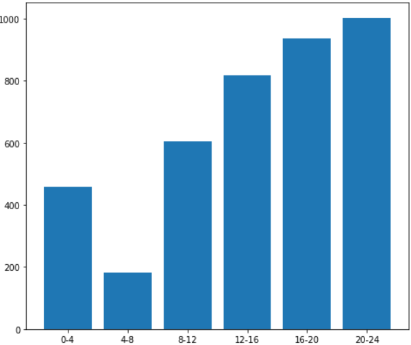

# Actividad 5
# Sebastián Hernández Mantilla


```python
import pandas as pd
import numpy as np
import matplotlib.pyplot as plt

```


```python
df = pd.read_csv(r'C:\Users\Sebastian Hernandez\Especializacion\Semestre2\Decisiones_incertidumbre\practicas\Actividad5\datos_horas_conexion.csv',';')
df.head()
```


<div>
<style scoped>
    .dataframe tbody tr th:only-of-type {
        vertical-align: middle;
    }

    .dataframe tbody tr th {
        vertical-align: top;
    }

    .dataframe thead th {
        text-align: right;
    }
</style>
<table border="1" class="dataframe">
  <thead>
    <tr style="text-align: right;">
      <th></th>
      <th>id_usuario</th>
      <th>Calificadora</th>
      <th>Correo</th>
      <th>Fecha Consulta</th>
      <th>Estado usuario</th>
    </tr>
  </thead>
  <tbody>
    <tr>
      <th>0</th>
      <td>c2290d89dfc4</td>
      <td>Buró de Crédito</td>
      <td>gmail.com</td>
      <td>19/01/21 9:20</td>
      <td>ACTIVO</td>
    </tr>
    <tr>
      <th>1</th>
      <td>8d24ef1d52d8</td>
      <td>Buró de Crédito</td>
      <td>gmail.com</td>
      <td>19/01/21 8:28</td>
      <td>ACTIVO</td>
    </tr>
    <tr>
      <th>2</th>
      <td>a5120d2c47fa</td>
      <td>Buró de Crédito</td>
      <td>gmail.com</td>
      <td>17/01/21 13:36</td>
      <td>ACTIVO</td>
    </tr>
    <tr>
      <th>3</th>
      <td>5a5d70893606</td>
      <td>Buró de Crédito</td>
      <td>edubc.mx</td>
      <td>20/01/21 9:27</td>
      <td>ACTIVO</td>
    </tr>
    <tr>
      <th>4</th>
      <td>4a2082948031</td>
      <td>Buró de Crédito</td>
      <td>gmail.com</td>
      <td>21/01/21 14:26</td>
      <td>ACTIVO</td>
    </tr>
  </tbody>
</table>
</div>


```python
df.describe()
```


<div>
<style scoped>
    .dataframe tbody tr th:only-of-type {
        vertical-align: middle;
    }

    .dataframe tbody tr th {
        vertical-align: top;
    }

    .dataframe thead th {
        text-align: right;
    }
</style>
<table border="1" class="dataframe">
  <thead>
    <tr style="text-align: right;">
      <th></th>
      <th>id_usuario</th>
      <th>Calificadora</th>
      <th>Correo</th>
      <th>Fecha Consulta</th>
      <th>Estado usuario</th>
    </tr>
  </thead>
  <tbody>
    <tr>
      <th>count</th>
      <td>4022</td>
      <td>4022</td>
      <td>4003</td>
      <td>4022</td>
      <td>4003</td>
    </tr>
    <tr>
      <th>unique</th>
      <td>3681</td>
      <td>1</td>
      <td>93</td>
      <td>3442</td>
      <td>3</td>
    </tr>
    <tr>
      <th>top</th>
      <td>fdcc844fb3b0</td>
      <td>Buró de Crédito</td>
      <td>gmail.com</td>
      <td>21/01/21 20:24</td>
      <td>ACTIVO</td>
    </tr>
    <tr>
      <th>freq</th>
      <td>66</td>
      <td>4022</td>
      <td>2812</td>
      <td>4</td>
      <td>3602</td>
    </tr>
  </tbody>
</table>
</div>


```python
df.dropna(inplace=True)
```

##### La columna 'Calificadora' es siempre igual y no aporta información 


```python
df['Calificadora'].value_counts()
```


    Buró de Crédito    4003
    Name: Calificadora, dtype: int64


```python
df['Calificadora'].unique()
```


    array(['Buró de Crédito'], dtype=object)


##### En la columna ' Correo' la gran mayoría son gmail y hotmail 


```python
df['Correo'].unique() #Existen muchos registros escritos mal
```


    array(['gmail.com', 'edubc.mx', 'oitlook.com', 'hotmail.com',
           'hotmail.es', 'outlook.com', 'gmail.comma', 'yahoo.com.mx',
           'gmail.Com', 'me.com', 'live.com.mx', 'gmail.com.mx',
           'ittepic.edu.mx', 'sohe95.com', 'multiva.com.mx', 'hotmai.com',
           'avantservices.com.mx', 'icloud.com', 'yahoo.com', 'live.com',
           'liverpool.com.mx', 'gmeil.com', 'GMAIL.COM', 'telefonica.com',
           'msn.com', 'gmail.comlaura', 'outlook.con', 'outlook.es',
           'hotmil.com', 'mail.ru', 'hormail.com', 'hotmail.comRICARDO',
           'g2telecom.com.mx', 'hotmail.con', 'hotmail.com.mx', 'gmail.con',
           'mail.com', 'mx.ey.com', 'saetowers.com.mx', '5675gmail.com',
           'tec.mx', 'gmail.comsagrario', 'hotmaol.com', 'gotmail.com',
           'yomax.com.mx', 'suramexico.com', 'g.conai.com', 'hitmail.com',
           'g.mail.com.mx', 'exatec.tec.mx', 'jotmail.com', 'gitsmfg.com',
           'sermatel.mx', 'prodigy.net.mx', 'outlook.coma', 'gmal.com',
           'gmai.com', '13gmail.com', 'g.mai.com', 'bbva.com', 'gamil.com',
           'madisa.com', 'GMAIL.com', '2473gmail.com',
           'hutchinson-seal-mexico.com', 'gmail.coml', 'olxautos.com',
           'gnail.com', 'gmil.com', 'osiux.ws', 'yansa.com.mx',
           'aefcm.nuevaescuela.mx', 'hatmail.com', 'MSN.COM', 'gimail.com',
           'HOTMAIL.COM', 'ymail.com', 'prodyaut.com', 'cfe.mx',
           'Hotmail.com', 'gmail.co.com', 'guanajuato.gob.mzx', 'live.co.uk',
           'riconsa.com', '232gmail.com', 'gmail.comcom', '1982gmail.com',
           'hotmail.Com', 'gmaim.com', 'hot.mail.com', 'occidente.edu.mx',
           'outlok.es', 'test.com'], dtype=object)


```python
#Se toman solo los registros repetidos mas de 5 veces para la gráfica
x = df['Correo'].value_counts()
x = x > 5
y = df['Correo'].value_counts()[x]

plt.figure(figsize=(18, 6), dpi=80)
plt.bar(y.index,y)
```


##### Para el análisis de la hora se dividio el campo de 'Fecha Consulta' en año, mes, día y hora y se dividió la hora en 6 grupos 


```python
from datetime import datetime


df['Fecha Consulta'] = df['Fecha Consulta'].apply(lambda x: datetime.strptime(x, "%d/%m/%y %H:%M") )

df['ano'] = df['Fecha Consulta'].apply(lambda x: x.year)
df['mes'] = df['Fecha Consulta'].apply(lambda x: x.month)
df['dia'] = df['Fecha Consulta'].apply(lambda x: x.day)

df['hora'] = df['Fecha Consulta'].apply(lambda x: x.hour)
```


```python
df
```


<div>
<style scoped>
    .dataframe tbody tr th:only-of-type {
        vertical-align: middle;
    }

    .dataframe tbody tr th {
        vertical-align: top;
    }

    .dataframe thead th {
        text-align: right;
    }
</style>
<table border="1" class="dataframe">
  <thead>
    <tr style="text-align: right;">
      <th></th>
      <th>id_usuario</th>
      <th>Calificadora</th>
      <th>Correo</th>
      <th>Fecha Consulta</th>
      <th>Estado usuario</th>
      <th>ano</th>
      <th>mes</th>
      <th>dia</th>
      <th>hora</th>
    </tr>
  </thead>
  <tbody>
    <tr>
      <th>0</th>
      <td>c2290d89dfc4</td>
      <td>Buró de Crédito</td>
      <td>gmail.com</td>
      <td>2021-01-19 09:20:00</td>
      <td>ACTIVO</td>
      <td>2021</td>
      <td>1</td>
      <td>19</td>
      <td>9</td>
    </tr>
    <tr>
      <th>1</th>
      <td>8d24ef1d52d8</td>
      <td>Buró de Crédito</td>
      <td>gmail.com</td>
      <td>2021-01-19 08:28:00</td>
      <td>ACTIVO</td>
      <td>2021</td>
      <td>1</td>
      <td>19</td>
      <td>8</td>
    </tr>
    <tr>
      <th>2</th>
      <td>a5120d2c47fa</td>
      <td>Buró de Crédito</td>
      <td>gmail.com</td>
      <td>2021-01-17 13:36:00</td>
      <td>ACTIVO</td>
      <td>2021</td>
      <td>1</td>
      <td>17</td>
      <td>13</td>
    </tr>
    <tr>
      <th>3</th>
      <td>5a5d70893606</td>
      <td>Buró de Crédito</td>
      <td>edubc.mx</td>
      <td>2021-01-20 09:27:00</td>
      <td>ACTIVO</td>
      <td>2021</td>
      <td>1</td>
      <td>20</td>
      <td>9</td>
    </tr>
    <tr>
      <th>4</th>
      <td>4a2082948031</td>
      <td>Buró de Crédito</td>
      <td>gmail.com</td>
      <td>2021-01-21 14:26:00</td>
      <td>ACTIVO</td>
      <td>2021</td>
      <td>1</td>
      <td>21</td>
      <td>14</td>
    </tr>
    <tr>
      <th>...</th>
      <td>...</td>
      <td>...</td>
      <td>...</td>
      <td>...</td>
      <td>...</td>
      <td>...</td>
      <td>...</td>
      <td>...</td>
      <td>...</td>
    </tr>
    <tr>
      <th>4017</th>
      <td>a7b8edae9a16</td>
      <td>Buró de Crédito</td>
      <td>gmail.com</td>
      <td>2021-01-06 11:10:00</td>
      <td>SIN VALIDAR</td>
      <td>2021</td>
      <td>1</td>
      <td>6</td>
      <td>11</td>
    </tr>
    <tr>
      <th>4018</th>
      <td>4b636433f200</td>
      <td>Buró de Crédito</td>
      <td>gmail.com</td>
      <td>2021-01-06 14:54:00</td>
      <td>SIN VALIDAR</td>
      <td>2021</td>
      <td>1</td>
      <td>6</td>
      <td>14</td>
    </tr>
    <tr>
      <th>4019</th>
      <td>4b636433f200</td>
      <td>Buró de Crédito</td>
      <td>gmail.com</td>
      <td>2021-01-06 23:43:00</td>
      <td>SIN VALIDAR</td>
      <td>2021</td>
      <td>1</td>
      <td>6</td>
      <td>23</td>
    </tr>
    <tr>
      <th>4020</th>
      <td>a7b8edae9a16</td>
      <td>Buró de Crédito</td>
      <td>gmail.com</td>
      <td>2021-01-06 21:21:00</td>
      <td>SIN VALIDAR</td>
      <td>2021</td>
      <td>1</td>
      <td>6</td>
      <td>21</td>
    </tr>
    <tr>
      <th>4021</th>
      <td>c5730eda6be5</td>
      <td>Buró de Crédito</td>
      <td>gmail.com</td>
      <td>2021-01-17 20:59:00</td>
      <td>SIN VALIDAR</td>
      <td>2021</td>
      <td>1</td>
      <td>17</td>
      <td>20</td>
    </tr>
  </tbody>
</table>
<p>4003 rows × 9 columns</p>
</div>


```python
df['hora1'] = df['hora'].apply(lambda x : '0-4' if ( 0 <= x < 4) else ( '4-8' if ( 4 <= x < 8) else ('8-12' if (8 <= x <12) else ('12-16' if (12 <= x < 16) else('16-20' if (16 <= x <20) else ('20-24'))))))
```


```python
df['hora1'] = df['hora'].apply(lambda x : '0-2' if ( 0 <= x < 2) else ( '2-4' if ( 2 <= x < 4) else ('4-6' if (4 <= x <6) else ('6-8' if (6 <= x < 8) else('8-10' if (8 <= x <10) else('10-12' if(10 <= x < 12) else('12-14' if(12 <= x < 14) else('14-16' if(14 <=x < 16) else('16-18' if(16<=x<18) else('18-20' if(18<=x<20) else('20-22' if(20<=x<22) else('22-24')) )))) ) )))))
```


```python
df['hora1'].unique()
```


    array(['8-10', '12-14', '14-16', '16-18', '22-24', '10-12', '2-4',
           '18-20', '20-22', '0-2', '6-8', '4-6'], dtype=object)


```python
#GRÁFICA PARA CONOCER LA DISTRIBUCIÓN DE HORAS 
df.groupby(['hora1'])['Estado usuario'].value_counts().unstack(0).plot.bar(figsize=(18,6))
#df.groupby('year').case_status.value_counts().unstack(0).plot.barh()
```




```python

df['hora'] = df['hora1']

df_ = df.groupby('Estado usuario')['hora'].count()
df_
```


    Estado usuario
    ACTIVO         3602
    DESACTIVADO      67
    SIN VALIDAR     334
    Name: hora, dtype: int64


##### De la última gráfica se ve que la mayor cantidad de usuarios que estan activos hicieron su consulta en las horas de la noche, de las 20 a las 24 horas. Dado que las otras columnas de la data no tienen mucha varianza y, por lo tanto no ofrecen información relevante, se considera que solo con el análisis de la hora de consulta se puede responder a la pregunta planteada: se recomienda configurar las horas de la pauta digital para el rango entre las 16 y las 24 horas


```python

```
